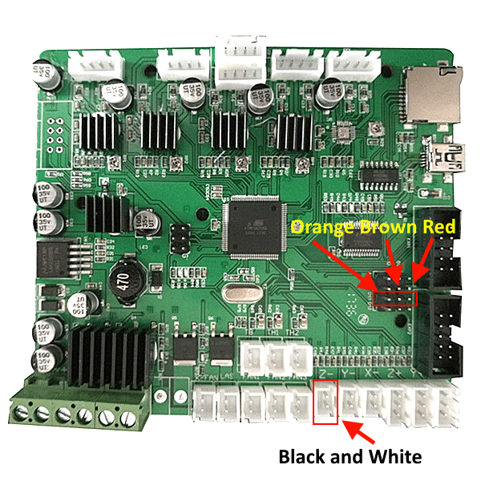

# Marlin 3D Printer Firmware for Creality CR-10S 500

This is a bugfix release branch source code for 1.1.7 downloaded on the 2017-12-15. This may be updated along the way.

I take no responsibility to damage to your 3D printer or your body parts when using this guide. Be smart.

This source contains configuration for my Creality CR-10S 500mm 3D printer.

## Prerequisites

- BLTouch sensor (or clone)
- CR-10S with unlocked bootloader
- This source code

## Configure for your 3D printer

You will need to adjust the following parameters in Configuration.h:

- X_BED_SIZE, Y_BED_SIZE, Z_MAX_POS - the size of the printing cube. I think CR-10S comes in 300, 400 and 500mm sizes

## Print the BLTouch holder

I am using this mount https://www.thingiverse.com/thing:2493610

It is not perfect is it is hard to tighten all screws, because mount is either in the way or BLTouch is covering the screws, but it is working for now.

Few tips:

- Mount can be printed in PLA
- Make sure you tighten screws!

## Wire BLTouch

BLTouch consists of 2 connectors:

- 3 Pin connector works as servo
- 2 Pin connector works as endstop

My board is green. There is a 3x4 pin connector on the board next to Ext1 and Ext2 connectors. You need to use D11 labeled pins and connect BLTouch like this:

       D11 <-> BLTouch
       -------------
        5V <-> Red
        G  <-> Brown 
(unlabled) <-> Orange

You have to replace the Z-min endstop switch with BLTouch 2 pin connector. The easiest way to do this I found by removing the connector next to Z-Min endstop and plugging BLTouch to the same connector.

## How to use

- Compile and upload firmware
- Test deploy and stow of BLTouch using menus in LCD
- Lift Z to about 40mm
- Run G28 command to home all axis
- Use your finger to push the pin back to test that BLTouch detection works before Z reaches the bed. Z should go back up and deploy sensor again. Use your finger to push the pin again.
- If printer stops, this means that the sensor works and now you can do the G28 command to home axis by using the sensor to touch the bed 

Stay next to power switch to turn off the machine in case nozzle rams into the bed if sensor is misconfigured or malfunctioned.

Will update this section along the way. I am currently focussed on making sure that repeatability is within margins for the sensor.

## Support

I have very limited time to provide support, but you can either have your questions asked in the issue tracker for this repository or CR-10S Facebook group https://www.facebook.com/groups/1408301692623865/

## Below information from the original Marlin firmware readme

Additional documentation can be found at the [Marlin Home Page](http://marlinfw.org/).
Please test this firmware and let us know if it misbehaves in any way. Volunteers are standing by!

## Bugfix Branch

__Not for production use. Use with caution!__

This branch is used to accumulate patches to the latest 1.1.x release version. Periodically this branch will form the basis for the next minor 1.1.x release.

Download earlier versions of Marlin on the [Releases page](https://github.com/MarlinFirmware/Marlin/releases). (The latest tagged release of Marlin is version 1.1.1.)

## Recent Changes
- Further integration of Unified Bed Leveling
- Initial UBL LCD Menu
- New optimized G-code parser singleton
- Initial M3/M4/M5 Spindle and Laser support
- Added M421 Q to offset a mesh point
- Refinements to G26 and G33
- Added M80 S to query the power state
- "Cancel Print" now shuts off heaters
- Added `EXTRAPOLATE_BEYOND_GRID` option for mesh-based leveling

## Submitting Patches

Proposed patches should be submitted as a Pull Request against this branch ([bugfix-1.1.x](https://github.com/MarlinFirmware/Marlin/tree/bugfix-1.1.x)).

- This branch is for fixing bugs and integrating any new features for the duration of the Marlin 1.1.x life-cycle. We've opted for a simplified branch structure while we work on the maintainability and encapsulation of code modules. Version 1.2 and beyond should improve on separation of bug fixes and cutting-edge development.
- Follow the proper coding style to gain points with the maintainers. See our [Coding Standards](http://marlinfw.org/docs/development/coding_standards.html) page for more information.
- Please submit your questions and concerns to the [Issue Queue](https://github.com/MarlinFirmware/Marlin/issues). The "naive" question is often the one we forget to ask.

### [RepRap.org Wiki Page](http://reprap.org/wiki/Marlin)

## Credits

The current Marlin dev team consists of:
 - Roxanne Neufeld [[@Roxy-3D](https://github.com/Roxy-3D)] - English
 - Scott Lahteine [[@thinkyhead](https://github.com/thinkyhead)] - English
 - Bob Kuhn [[@Bob-the-Kuhn](https://github.com/Bob-the-Kuhn)] - English
 - Andreas Hardtung [[@AnHardt](https://github.com/AnHardt)] - Deutsch, English
 - Nico Tonnhofer [[@Wurstnase](https://github.com/Wurstnase)] - Deutsch, English
 - Jochen Groppe [[@CONSULitAS](https://github.com/CONSULitAS)] - Deutsch, English
 - João Brazio [[@jbrazio](https://github.com/jbrazio)] - Portuguese, English
 - Bo Hermannsen [[@boelle](https://github.com/boelle)] - Danish, English
 - Bob Cousins [[@bobc](https://github.com/bobc)] - English
 - [[@maverikou](https://github.com/maverikou)]
 - Chris Palmer [[@nophead](https://github.com/nophead)]
 - [[@paclema](https://github.com/paclema)]
 - Erik van der Zalm [[@ErikZalm](https://github.com/ErikZalm)]
 - David Braam [[@daid](https://github.com/daid)]
 - Bernhard Kubicek [[@bkubicek](https://github.com/bkubicek)]

More features have been added by:
 - Alberto Cotronei [[@MagoKimbra](https://github.com/MagoKimbra)] - English, Italian
 - Thomas Moore [[@tcm0116](https://github.com/tcm0116)]
 - Ernesto Martinez [[@emartinez167](https://github.com/emartinez167)]
 - Petr Zahradnik [[@clexpert](https://github.com/clexpert)]
 - Kai [[@Kaibob2](https://github.com/Kaibob2)]
 - Edward Patel [[@epatel](https://github.com/epatel)]
 - F. Malpartida [[@fmalpartida](https://github.com/fmalpartida)] - English, Spanish
 - [[@esenapaj](https://github.com/esenapaj)] - English, Japanese
 - [[@benlye](https://github.com/benlye)]
 - [[@Tannoo](https://github.com/Tannoo)]
 - [[@teemuatlut](https://github.com/teemuatlut)]
 - [[@bgort](https://github.com/bgort)]
 - Luc Van Daele[[@LVD-AC](https://github.com/LVD-AC)] - Dutch, French, English
 - [[@paulusjacobus](https://github.com/paulusjacobus)]
 - ...and many others

## License

Marlin is published under the [GPL license](/LICENSE) because we believe in open development. The GPL comes with both rights and obligations. Whether you use Marlin firmware as the driver for your open or closed-source product, you must keep Marlin open, and you must provide your compatible Marlin source code to end users upon request. The most straightforward way to comply with the Marlin license is to make a fork of Marlin on Github, perform your modifications, and direct users to your modified fork.

While we can't prevent the use of this code in products (3D printers, CNC, etc.) that are closed source or crippled by a patent, we would prefer that you choose another firmware or, better yet, make your own.
